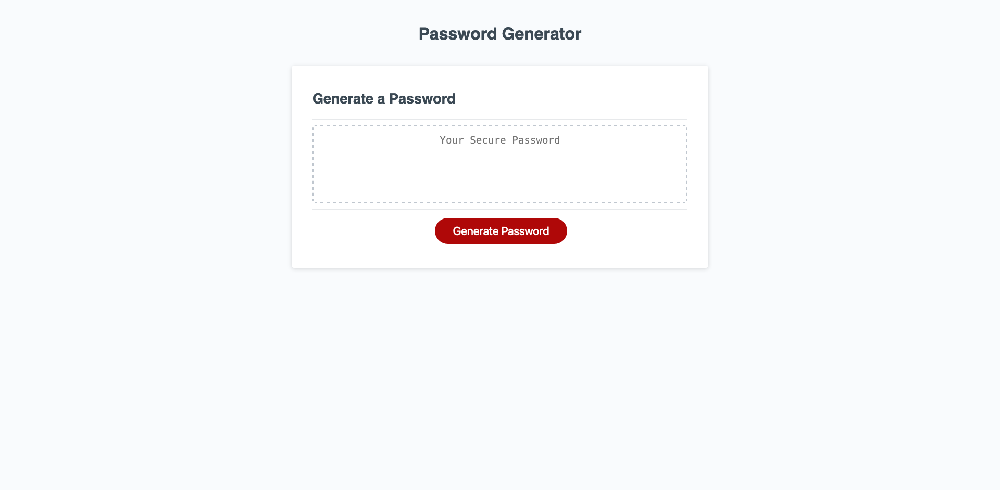

# Password Generator

[Click here to see live page](https://zachshouts.github.io/password-generator/)

## Description

During this challenge the following was added to the starter code

* Added 6 global variables, 5 to hold user input, and 1 to hold the final output

* Added 5 arrays, 4 to hold available characters, and 1 to hold user specified characters

* Added askQuestions function to receive user input on the parameters of the final password

* Added generateParams function to fill the params array with user specified characters

* Added generatePassword function to randomly select a character from params array and add it to the final output
